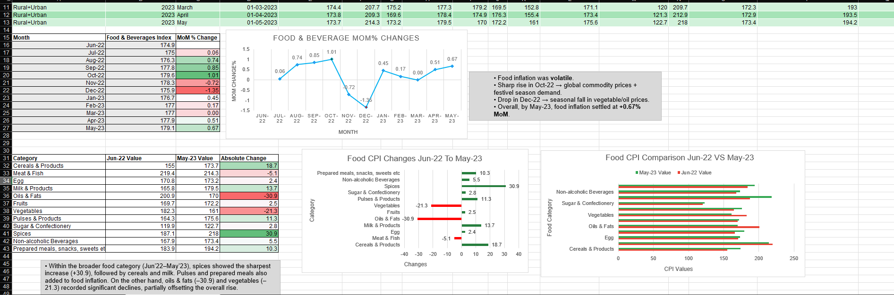
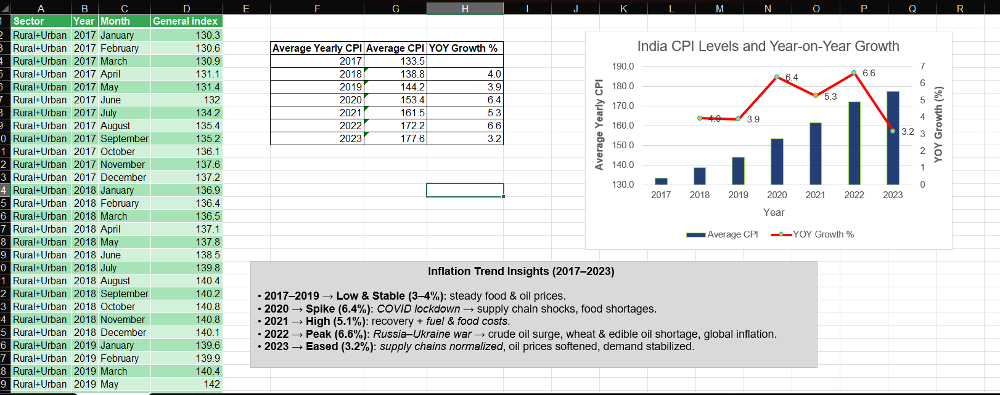

# 📊 CPI India Inflation Analysis (2017–2023)

## 🔹 Overview  
This project analyzes **India’s Consumer Price Index (CPI)** trends across multiple sectors.  
It focuses on **2017–2023**, compares **Pre-COVID vs Post-COVID**, and studies correlation with **Oil Prices (2021–2023)**.  

> **Dataset Note:** Original dataset spans 2013–2023; analysis focused on 2017–2023 for relevance.  

---

## 🔹 Key Highlights  
- Cleaned CPI dataset using **Power Query** 
- Highest contribution by Category for **May 2023** 
- Calculated **Month-over-Month (MoM)** and **Year-over-Year (YoY)** inflation  
- Analyzed **Food & Beverages** subcategories  
- Compared **Pre-COVID vs Post-COVID inflation trends**  
- Studied correlation of **Oil Prices** with CPI categories  

---

## 🔹 Tools Used  
- **Microsoft Excel** (Power Query, Pivot Tables, Charts)  

---

## 🔹 Insights  
- Food & Beverages showed the highest volatility, mainly driven by Oils & Fats.

- Housing remained stable during and after COVID-19.

- Oil prices had a strong correlation with:
 Fuel & Light (0.57)
 Food & Beverages (0.58)

- Post-COVID inflation trends show gradual normalization across sectors.

🧾 Conclusion

The analysis reveals that global oil fluctuations and the COVID-19 period significantly influenced India’s inflation patterns. By 2023, CPI levels began to stabilize, indicating improved economic recovery and price control.

---

## 🔹 Screenshots :
> Replace these with actual images from your Excel dashboards  

  
  

---

## 🔹 Repository Contents  
- `CPI India Inflation Project.xlsx` → Full project (7 sheets with analysis & dashboards)  

---

## 👤 About the Author  
**Rahul Singh**  
MBA Candidate | Aspiring Data Analyst  
📌 [LinkedIn](https://www.linkedin.com/in/rahul-singh-184951257/) | [Naukri](https://www.naukri.com/mnjuser/profile?id=&altresid)
